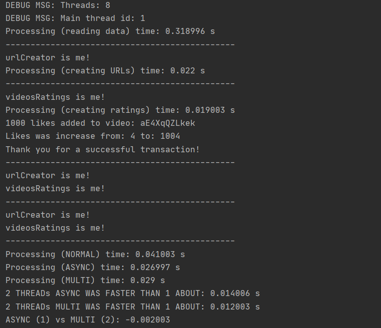

# MultithreadingCppWithCSVData
Budowanie wielowątkowej aplikacji w celu stworzenia bardziej zaawansowanego projektu c++ do portfolio, zgodnie z zaleceniami rekrutacyjnymi odnośnie ćwiczenia praktycznego języka c++ po ukończeniu akademii programistycznej. Zawsze musi być ambitnie, a wątki idealnie się w to wpisują w moim postrzeganiu ich poziomu ;)  TBC ... :) 

ACTUALLY OUTPUT: 

CLUE - async threads should be faster if we got 'tasks-type' construction. Default multithread should be faster if we got 'workers-type' construction. 
CLUE 2 - there are still too less operations to compare effective works (data.csv got about 80k records). Working to add new functionality. 
